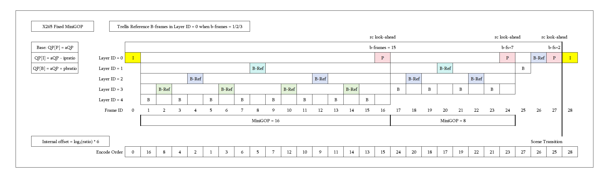
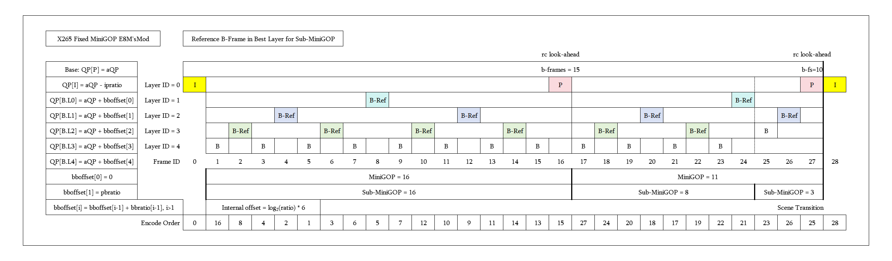
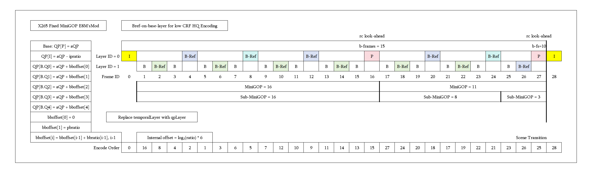
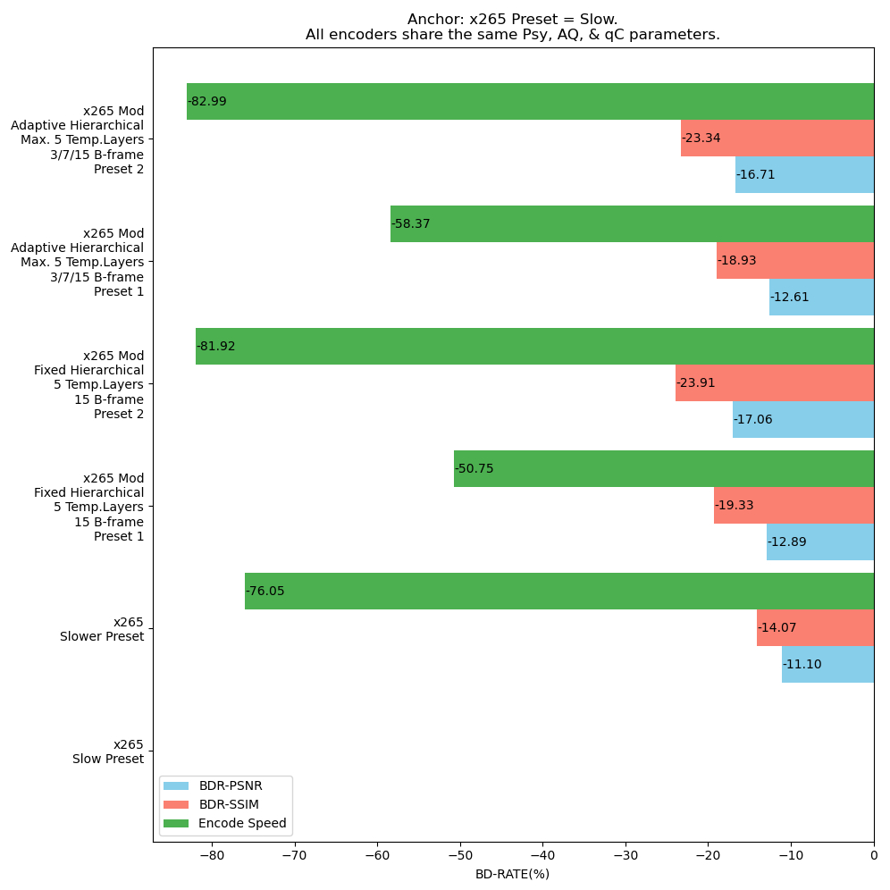

# x265 MiniGOP Mod HEVC Encoder

Modified entirely based on Release 4.1.

Primary objectives: Adjusting the inter-layer quantisation ratio to achieve better BD-PSNR, BD-SSIM, and BD-VMAF.

Usage
======

1. Adaptive MiniGOP (b-slice frames: 1/3/7/15, Perfect binary tree) and adaptive MiniGOP b-frame bias control:
   
   ``--temporal-layers=5 --b-adapt 2 --bframe-bias=150``
   or
   ``--tune="adaptminigop"``

   When ``--temporal-layers > 3`` , --bframe-bias should in the range of  [100, 500].

   
2. BB-ratio rate-control, using ':' to separate the independent factor like ``--pbratio`` for each layer:

   ``--bbratio=1.6:1.4:1.2`` for ``--temporal-layers = 5``.
   
   ``--bbratio=1.3:1.1`` means Layer-1 / Layer-2 = 1.3, Layer-2 / Layer-3 = 1.2 for ``--temporal-layers = 4``.
   
   ``--bbratio=1.2`` equals ``--bbratio=1.2:1.2:1.2`` for ``--temporal-layers = 5``.

   Using ``--tune='minigop8'`` or ``--tune='minigop16'`` to quickly configure all settings by default.

3. Updated bframes < minigop's fixed bframes mechanism of lookahead slice decision to improve efficiency. Had passed a lot of hardware decoding tests.
  
   

4. Added ``'--bref-on-base-layer'`` for frame intervals <=4 in the base layer when using temporal sublayers, When the CRF is low, enabling this feature can enhance both BD-PSNR and BD-SSIM.

   **WARNING: Experimental feature**
   

In certain episodes, employing higher pbratio and bbratio values (as per the earlier preset) yields the following appreciable improvements in BD-PSNR and BD-SSIM.

  

To enhance all-scenario visual quality and minimise perceptible QP fluctuations, the actual reduction has been adjusted to the current preset level.

Nevertheless, it still offers a considerable improvement in BD-Rate.

----------------

[x265](https://www.videolan.org/developers/x265.html) is an open source HEVC encoder. You can git clone original repository at [Bitbucket](https://bitbucket.org/multicoreware/x265_git.git).

[x265](https://www.videolan.org/developers/x265.html) is free to use under the [GNU GPL](http://www.gnu.org/licenses/gpl-2.0.html) and is also available under a commercial [license](http://x265.org).
