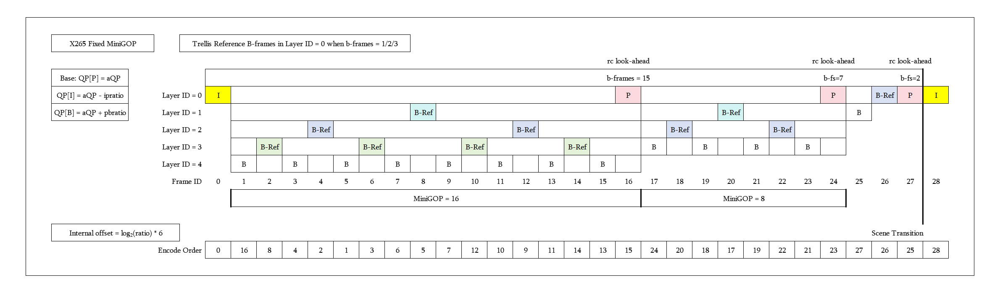
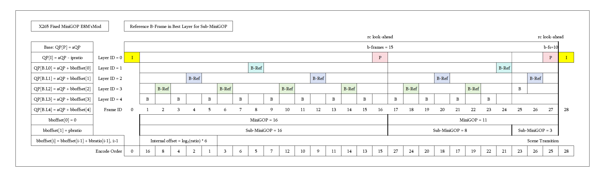
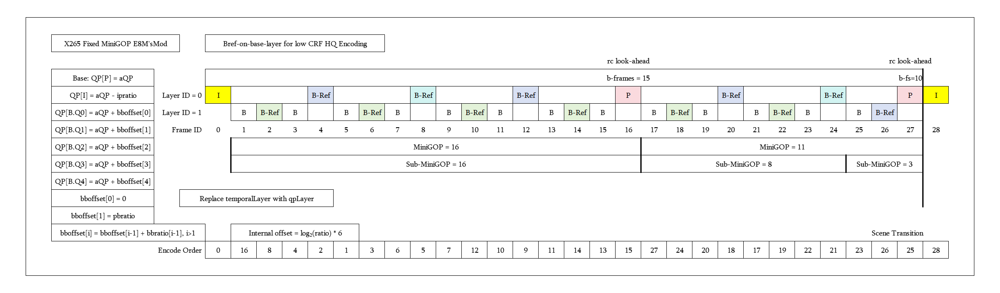
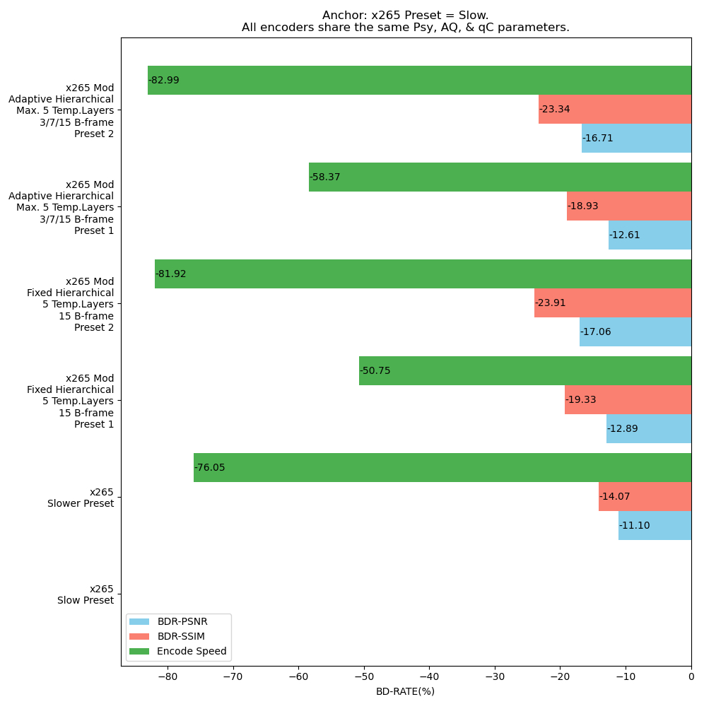

# x265 MiniGOP Mod HEVC Encoder

Modified entirely based on Release 4.1.

Primary objectives: Adjusting the inter-layer quantisation ratio to achieve better BD-PSNR, BD-SSIM, and BD-VMAF.

Usage
======

1. b-adapt=3: a viterbi B path selection with adaptive reference B-frame insertion according to the minimal cost.

   ``--b-adapt=3 --bframes=N``

   It is not recommended to use bframes greater than 12.

   When ``--b-adapt=3 --temporal-layers=4/5/6/7 --bframes=N (Odd) ``, using a Hierarchical B-frame insertion.

   Set the --bframes to at least: temporal-layers * 2 - 3.

   
2. Non-Dyadic Hierarchical MiniGOP (b-slice frames: 5/6/7/8, 3-layers: 1P-2B-3b/1P-2B-4b/1P-2B-5b/1P-2B-6b):

   ``--temporal-layers=3 --bframes=5/6/7/8``
   or
   ``--tune="minigop9nd"``

   
3. Adaptive Hierarchical MiniGOP Size (b-slice frames: 1~N) and adaptive MiniGOP b-frame bias control:
   
   ``--temporal-layers=5 --b-adapt=3 --bframes=4~16 --bframe-bias=0``
   or
   ``--temporal-layers=5 --b-adapt=2 --bframes=15 --bframe-bias=0``
   or
   ``--tune="adaptminigop"``

   When ``--temporal-layers > 3`` , --bframe-bias should in the range of  [-90, 300].

   
4. BB-ratio rate-control, using ':' to separate the independent factor like ``--pbratio`` for each layer and RB-ratio rate-control for Ref to Non-Ref B-Frame:

   ``--bbratio=1.6:1.4:1.2 --rbratio=0.8`` for ``--temporal-layers = 5``.
   
   ``--bbratio=1.3:1.1`` means Layer-1 / Layer-2 = 1.3, Layer-2 / Layer-3 = 1.2 for ``--temporal-layers = 4``.
   
   ``--bbratio=1.2`` equals ``--bbratio=1.2:1.2:1.2`` for ``--temporal-layers = 5``

   ``--rbratio=0.8`` also equals or QP of [Non-Ref B-Frame] = 0.8 * QP of [Ref B-Frame] for ``--b-adapt = 3`` and ``--temporal-layers > 3``.

   Using ``--tune='minigop8'`` or ``--tune='minigop16'`` to quickly configure all settings by default.

   
5. Updated bframes < minigop's fixed bframes mechanism of lookahead slice decision to improve efficiency. Had passed a lot of hardware decoding tests.
  
   

   
6. Added ``'--bref-on-base-layer'`` for frame intervals <=4 in the base layer when using temporal sublayers, When the CRF is low, enabling this feature can using ``--ref=8`` to enhance both BD-PSNR and BD-SSIM.

   **WARNING: Experimental feature**
   

   
7. ``temporal-layer=2`` refers to a situation where all B-slices at even positions are BREF and located in the base layer, while all B-slices at odd positions are Non-Ref-B and located in the enhanced layer.

   
8. Bug Fixed: Added VBVLookAhead, cuTree, and slicetypePathCost for All of ``--temporal-layers > 1`` and single-layer ``--b-adapt=3``.

In certain episodes, employing higher pbratio and bbratio values (as per the earlier preset) yields the following appreciable improvements in BD-PSNR and BD-SSIM.

  

To enhance all-scenario visual quality and minimise perceptible QP fluctuations, the actual reduction has been adjusted to the current preset level.

Nevertheless, it still offers a considerable improvement in BD-Rate.

----------------

[x265](https://www.videolan.org/developers/x265.html) is an open source HEVC encoder. You can git clone original repository at [Bitbucket](https://bitbucket.org/multicoreware/x265_git.git).

[x265](https://www.videolan.org/developers/x265.html) is free to use under the [GNU GPL](http://www.gnu.org/licenses/gpl-2.0.html) and is also available under a commercial [license](http://x265.org).
